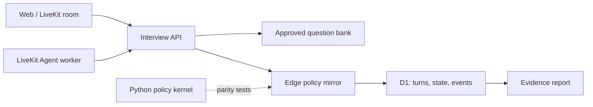

# StatInterview Coach

[](https://github.com/soberlady/statinterview-coach/actions/workflows/ci.yml)

An uncertainty-aware, adaptive interview training agent for Chinese data
analysis internships. It asks two public anchors, freezes two JD-directed
baseline questions, then selects three posterior-adaptive questions. When
evidence is weak, it inserts at most two bounded verifications or abstains
instead of inventing a confident score.

> This is a training product, not a hiring predictor. It evaluates answer
> content only and does not score faces, voices, accents, emotions, or gender.
> The public portfolio demo is a read-only deterministic replay with synthetic
> data. The full data-bearing deployment remains owner-only; per-user
> authorization is required before any future shared beta.

## Live demo

**[Open the 3-minute interactive demo](https://statinterview-coach-cn.keen-grass-7274.chatgpt.site/showcase)**

The public route demonstrates `VERIFY -> ABSTAIN -> ACCEPT`, posterior updates,
adaptive question ranking and deterministic policy replay. It runs entirely on
fixed synthetic fixtures: no login, model call, database write, microphone or
candidate data is involved. The deployment Worker redirects data-bearing pages
and rejects every operational interview API. Clone the repository to run the
complete text/voice system locally.

## What works now

- complete text interview flow with refresh-safe checkpoints and
  pause/resume recovery, including the finalizing-to-report edge case;
- one-click `guided_demo` path that deterministically demonstrates
  `VERIFY -> ABSTAIN -> ACCEPT`, adaptive selection and report replay without
  external model calls; every fixture score is visibly synthetic and demo
  sessions cannot enter user-feedback data;
- 24-question Chinese data-analysis bank with weighted rubrics;
- two comparable public anchors, two frozen JD-directed baselines and three
  deterministic posterior-adaptive questions;
- bounded reliability verification and explicit `ABSTAIN`;
- evidence-linked reports, uncertainty display, and user feedback collection;
- D1 persistence for sessions, turns, skill states, Agent events and feedback;
- standalone Python policy, scorer-evaluation and voice helpers with 78 tests;
- browser LiveKit token/room flow plus a LiveKit 1.6 voice worker that stores
  committed transcript fragments verbatim, restores the authoritative current
  question on reconnect and uses Mandarin-first synthesis;
- transport-independent voice-turn controller with deterministic fault
  injection for short transcripts, timeouts, rejected writes, stale
  checkpoints, malformed success responses and finalization failures;
- privacy-bounded voice observability with connection and
  transcript-to-checkpoint p50/p95 in the evidence report;
- final per-session LiveKit Inference usage export with model-level token,
  duration and character accounting, explicit pricing coverage and a
  versioned marginal list-price estimate; independently configured semantic
  scorer token costs join the same completed-interview total;
- shared Python/TypeScript golden fixtures for posterior and utility parity;
- deterministic decision replay with a SHA-256 policy fingerprint, invariant
  checks and top-three counterfactual question rankings;
- strict semantic-scoring inference plus a frozen double-label evaluation
  pipeline with grouped bootstrap and risk-coverage checks; the checked-in
  12-answer fixture is synthetic and the formal scorer gate is `NOT_READY`;
  release metrics are restricted to one frozen run on `locked_test`;
- reproducible fixed/random/adaptive policy benchmark and in-product
  experiment page;
- deployable vinext/Cloudflare Sites web application.
- isolated public portfolio mode with a browser-only interactive replay and a
  Worker-level deny boundary around interview, report, history and voice APIs;

Without a semantic model key, the web app enters a transparent fallback mode:
it measures observable answer structure and domain-term coverage, labels the
result, and never writes that structure-only score into the ability posterior.
When an OpenAI-compatible scorer is configured, two role-separated passes from
the configured model score every weighted rubric criterion; only verbatim
answer excerpts count as evidence, and reviewer disagreement lowers
reliability.

## Why this is not another “AI interviewer”

Most demos generate questions and a final score. This project makes the
decision policy inspectable:

1. two public anchors establish a comparable baseline;
2. two JD-directed baseline questions freeze role coverage before answers can
   influence the route;
3. a simplified Rasch posterior stores both ability and uncertainty;
4. expected-value selection blends uncertainty, difficulty, JD relevance,
   coverage and time;
5. reliability is derived from observable evidence signals, not an LLM's
   self-reported confidence;
6. every answer, transition, decision reason and checkpoint is persisted;
7. reports link conclusions back to exact answer excerpts;
8. the complete question path can be replayed from persisted turns to detect
   a question that was approved by the bank but not selected by the policy.

## Architecture



The Python kernel is the canonical algorithm implementation. The TypeScript
edge mirror keeps the private web demo deployable on Cloudflare. Shared golden
fixtures verify posterior updates, uncertainty summaries, information gain and
utility signals in both implementations.

## Measured result

`experiments/run_policy_benchmark.py` runs a deterministic, paired synthetic
benchmark. With seed `20260730`, 4,000 simulated candidates and the same
seven-question budget, the three-stage adaptive policy reduced job-weighted
MAE by 3.83% versus the fixed sequence (paired absolute difference 95%
interval: `[-0.0312, -0.0223]`). The 90% posterior interval covered 90.0% of simulated
latent abilities.

The effect varies by role profile and is largest for the data-engineering
profile. This supports a narrow claim: the policy allocates limited follow-up
questions more efficiently under its simulation assumptions. It does not
prove hiring validity or real-user learning impact. See the in-product `/lab`
page and [experiment report](docs/EXPERIMENT_RESULTS.md).

## Local development

Prerequisites: Node.js `>=22.13`, Python `>=3.11`.

```powershell
npm install
npm run db:local
npm run dev
```

Open `http://localhost:3000`.

For a repeatable interview demo, choose **进入引导演示** on the landing page
and use the answer option marked **推荐步骤**. The first weak answer triggers a
bounded verification, the verification remains insufficient and abstains, and
the remaining fixture answers establish evidence before three adaptive turns.

Agent kernel:

```powershell
Set-Location services\agent
python -m venv .venv
.\.venv\Scripts\Activate.ps1
python -m pip install -e ".[dev]"
pytest
```

Voice worker:

```powershell
python -m pip install -e ".[voice,dev]"
Copy-Item ..\..\.env.example ..\..\.env
python -m statinterview_agent.livekit_worker console
```

The browser requests a short-lived room token from
`/api/interviews/:id/voice-token`. The token explicitly dispatches the
`statinterview-coach` worker. Without LiveKit credentials the endpoint returns
`503 VOICE_NOT_CONFIGURED` and the text interview remains available.

Optional semantic scoring uses the three
`STATINTERVIEW_SCORER_*` values documented in `.env.example`. Provider failure
automatically falls back to the labeled structure heuristic.

## Verification

```powershell
npm run doctor
npm run verify
```

`doctor` validates configuration groups and deployment files without printing
secret values. `verify` is the clean-checkout gate used by GitHub Actions: it
validates content, builds the app, runs Python/TypeScript/rendered-output tests,
exercises the local D1 API end to end and regenerates all frozen synthetic
evidence. `/api/health` provides a non-secret database/question-bank/policy
readiness check for a running deployment.

See [architecture](docs/ARCHITECTURE.md),
[evaluation plan](docs/EVALUATION.md),
[semantic scorer protocol](docs/SCORING_EVALUATION.md),
[voice evaluation protocol](docs/VOICE_EVALUATION.md),
[inference cost protocol](docs/COST_OBSERVABILITY.md), and
[implementation status](docs/IMPLEMENTATION_STATUS.md). The
[release checklist](docs/RELEASE_CHECKLIST.md) keeps machine gates separate
from human-study gates. For interview
preparation, use [INTERVIEW_GUIDE.md](docs/INTERVIEW_GUIDE.md).

## Upstream and licenses

The realtime architecture follows the official
[LiveKit Agents Python starter](https://github.com/livekit-examples/agent-starter-python)
and [LiveKit Meet](https://github.com/livekit-examples/meet) interaction model.
The current repository is an original implementation, not a hidden fork.
See [UPSTREAM.md](docs/UPSTREAM.md) for the exact reuse boundary.
