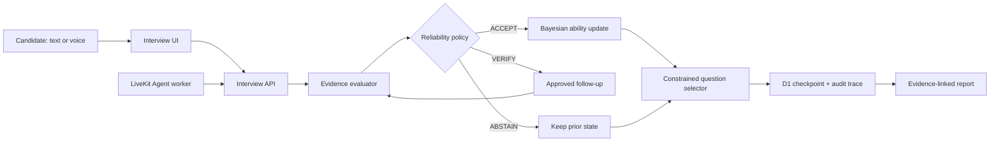

# StatInterview Coach

[](https://github.com/soberlady/statinterview-coach/actions/workflows/ci.yml)
[](LICENSE)
[](https://statinterview-coach-cn.keen-grass-7274.chatgpt.site/showcase)

**面向中文数据分析岗位的、不确定性感知的自适应面试训练 Agent。**

StatInterview Coach does more than generate questions and a final score. It
maintains an explicit ability state, chooses the next approved question under
a fixed interview budget, verifies weak evidence, and preserves a replayable
decision trail from raw answer to final report.

[Try the 3-minute public demo](https://statinterview-coach-cn.keen-grass-7274.chatgpt.site/showcase)
· [Architecture](docs/ARCHITECTURE.md)
· [Evaluation](docs/EVALUATION.md)
· [Interview guide](docs/INTERVIEW_GUIDE.md)

<p align="center">
  
</p>

## What makes it an Agent

| Capability | Implementation |
| --- | --- |
| Adaptive decisions | Two public anchors, two frozen JD-directed baselines, then three posterior-adaptive questions selected with uncertainty, information gain, relevance, coverage, difficulty and time constraints. |
| Reliability control | Weak or conflicting evidence triggers a bounded approved follow-up or `ABSTAIN`; an LLM's self-reported confidence is never trusted. |
| Auditable execution | Every answer, state transition, ranking and checkpoint is persisted. Reports replay the complete path, verify five invariants and fingerprint the policy trace with SHA-256. |
| Realtime voice | LiveKit browser audio and a Python Agents worker preserve final raw transcripts, wait for transcript stability, recover checkpoints and fall back safely to text. |
| Evidence-bound scoring | Two role-separated rubric passes may repair obvious ASR errors for scoring, while quoted evidence must remain a verbatim substring of the original answer. |

## Measured result

In a deterministic paired simulation of **4,000 candidates** under the same
seven-question budget, the three-stage adaptive policy reduced job-weighted
MAE by **3.83%** versus a fixed sequence. The paired absolute-difference 95%
interval was `[-0.0312, -0.0223]`, and the 90% posterior interval covered
90.0% of simulated latent abilities.

This is evidence about the frozen simulation and implementation—not proof of
hiring validity or real-user learning impact. The effect varies by job profile,
and the formal human-data scorer gate remains `NOT_READY`. See the
[experiment report](docs/EXPERIMENT_RESULTS.md) and
[release checklist](docs/RELEASE_CHECKLIST.md).

## System flow



The Python kernel is the canonical policy implementation. A TypeScript edge
mirror keeps the web application deployable on Cloudflare; shared golden
fixtures check posterior updates, information gain and utility parity between
the two implementations.

## What works now

- end-to-end Chinese text and LiveKit voice interview flows with text fallback;
- 24 approved data-analysis questions with weighted rubrics;
- refresh-safe D1 checkpoints, pause/resume recovery and atomic turn writes;
- deterministic adaptive selection, bounded verification and explicit
  `ABSTAIN`;
- evidence-linked reports with uncertainty, top-three counterfactual rankings,
  policy replay and tamper detection;
- auditable ASR repair that preserves raw transcripts and protects numeric,
  percentage, negation and causal evidence;
- model, latency and marginal-cost telemetry for voice and semantic scoring;
- 99 Python Agent tests plus TypeScript parity, rendered-output, fault-injection
  and local D1 end-to-end coverage;
- a one-click synthetic guided path and an isolated read-only public showcase;
- a clean-checkout GitHub Actions gate that rebuilds all frozen evidence.

Without a semantic model key, the application enters a labeled structure-only
fallback that cannot update the ability posterior. With an OpenAI-compatible
scorer, two role-separated passes score each rubric criterion; reviewer
disagreement lowers reliability.

## Public demo and safety boundary

The public demo replays `VERIFY -> ABSTAIN -> ACCEPT`, posterior updates,
adaptive rankings and decision audit entirely from fixed synthetic fixtures.
It performs no model calls, database writes, microphone access or candidate
data collection. Operational interview APIs are blocked at the Worker boundary.
The complete data-bearing deployment remains owner-only until per-user
authorization and the human-study release gates are complete.

## Local development

Prerequisites: Node.js `>=22.13`, Python `>=3.11`.

```powershell
npm install
npm run db:local
npm run dev
```

Open `http://localhost:3000`.

For a repeatable interview demo, choose **进入引导演示** on the landing page
and use the answer option marked **推荐步骤**. The first weak answer triggers a
bounded verification, the verification remains insufficient and abstains, and
the remaining fixture answers establish evidence before three adaptive turns.

Agent kernel:

```powershell
Set-Location services\agent
python -m venv .venv
.\.venv\Scripts\Activate.ps1
python -m pip install -e ".[dev]"
pytest
```

Voice worker:

```powershell
python -m pip install -e ".[voice,dev]"
Copy-Item ..\..\.env.example ..\..\.env
python -m statinterview_agent.livekit_worker console
```

The browser requests a short-lived room token from
`/api/interviews/:id/voice-token`. The token explicitly dispatches the
`statinterview-coach` worker. Without LiveKit credentials the endpoint returns
`503 VOICE_NOT_CONFIGURED` and the text interview remains available.

Optional semantic scoring uses the three
`STATINTERVIEW_SCORER_*` values documented in `.env.example`. Provider failure
automatically falls back to the labeled structure heuristic.

## Verification

```powershell
npm run doctor
npm run verify
```

`doctor` validates configuration groups and deployment files without printing
secret values. `verify` is the clean-checkout gate used by GitHub Actions: it
validates content, builds the app, runs Python/TypeScript/rendered-output tests,
exercises the local D1 API end to end and regenerates all frozen synthetic
evidence. `/api/health` provides a non-secret database/question-bank/policy
readiness check for a running deployment.

See [architecture](docs/ARCHITECTURE.md),
[evaluation plan](docs/EVALUATION.md),
[semantic scorer protocol](docs/SCORING_EVALUATION.md),
[voice evaluation protocol](docs/VOICE_EVALUATION.md),
[inference cost protocol](docs/COST_OBSERVABILITY.md), and
[implementation status](docs/IMPLEMENTATION_STATUS.md). The
[release checklist](docs/RELEASE_CHECKLIST.md) keeps machine gates separate
from human-study gates. For interview
preparation, use [INTERVIEW_GUIDE.md](docs/INTERVIEW_GUIDE.md).

## Upstream and licenses

The realtime architecture follows the official
[LiveKit Agents Python starter](https://github.com/livekit-examples/agent-starter-python)
and [LiveKit Meet](https://github.com/livekit-examples/meet) interaction model.
The current repository is an original implementation, not a hidden fork.
See [UPSTREAM.md](docs/UPSTREAM.md) for the exact reuse boundary.
