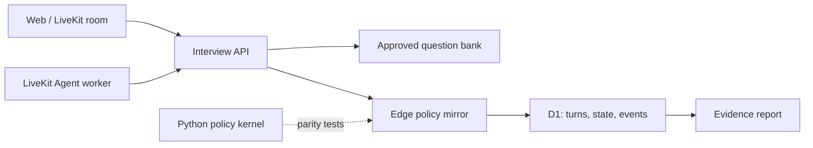

# StatInterview Coach

An uncertainty-aware, adaptive interview training agent for Chinese data
analysis internships. It asks four fixed anchor questions, then selects two
questions that reduce the largest remaining ability uncertainty. When evidence
is weak, it verifies or abstains instead of inventing a confident score.

> This is a training product, not a hiring predictor. It evaluates answer
> content only and does not score faces, voices, accents, emotions, or gender.

## What works now

- complete text interview flow with refresh-safe checkpoints;
- 24-question Chinese data-analysis bank with weighted rubrics;
- four comparable anchor questions plus deterministic adaptive selection;
- bounded reliability verification and explicit `ABSTAIN`;
- evidence-linked reports, uncertainty display, and user feedback collection;
- D1 persistence for sessions, turns, skill states, Agent events and feedback;
- standalone Python policy kernel with 17 tests;
- optional LiveKit 1.6 voice worker that stores final transcripts verbatim;
- deployable vinext/Cloudflare Sites web application.

Without a semantic model key, the web app enters a transparent fallback mode:
it measures observable answer structure and domain-term coverage, labels the
result, and refuses to turn low-reliability evidence into a stable ability
update. A rubric-scoring model adapter is the next production milestone.

## Why this is not another “AI interviewer”

Most demos generate questions and a final score. This project makes the
decision policy inspectable:

1. anchors establish a comparable baseline;
2. a simplified Rasch posterior stores both ability and uncertainty;
3. expected-value selection blends uncertainty, difficulty, JD relevance,
   coverage and time;
4. reliability is derived from observable evidence signals, not an LLM's
   self-reported confidence;
5. every answer, transition, decision reason and checkpoint is persisted;
6. reports link conclusions back to exact answer excerpts.

## Architecture



The Python kernel is the canonical algorithm implementation. The TypeScript
edge mirror keeps the public demo deployable on Cloudflare. Parity fixtures
between both implementations are planned before model evaluation claims are
published.

## Local development

Prerequisites: Node.js `>=22.13`, Python `>=3.11`.

```powershell
npm install
npm run db:local
npm run dev
```

Open `http://localhost:3000`.

Agent kernel:

```powershell
Set-Location services\agent
python -m venv .venv
.\.venv\Scripts\Activate.ps1
python -m pip install -e ".[dev]"
pytest
```

Voice worker:

```powershell
python -m pip install -e ".[voice,dev]"
Copy-Item ..\..\.env.example ..\..\.env
python -m statinterview_agent.livekit_worker console
```

## Verification

```powershell
npm run db:generate
node content\validate-question-bank.mjs
npm run lint
npm run build
```

See [architecture](docs/ARCHITECTURE.md),
[evaluation plan](docs/EVALUATION.md), and
[implementation status](docs/IMPLEMENTATION_STATUS.md).

## Upstream and licenses

The realtime architecture follows the official
[LiveKit Agents Python starter](https://github.com/livekit-examples/agent-starter-python)
and [LiveKit Meet](https://github.com/livekit-examples/meet) interaction model.
The current repository is an original implementation, not a hidden fork.
See [UPSTREAM.md](docs/UPSTREAM.md) for the exact reuse boundary.
