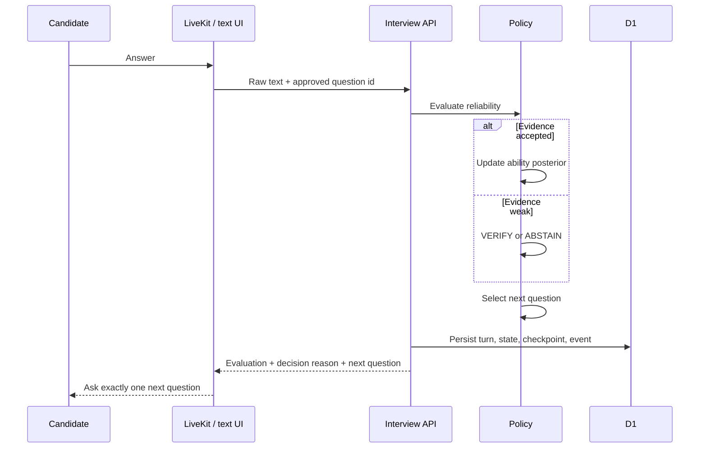
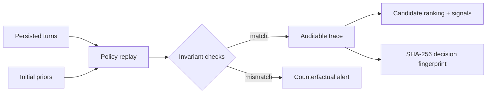
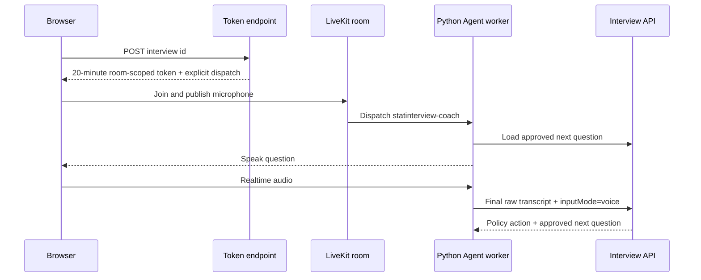

# Architecture

## System boundary

The browser and LiveKit worker are transports. They are not allowed to choose a
question, overwrite a score, or paraphrase stored evidence. All decision state
passes through the interview API.



## State machine

Happy path:

```text
CREATED -> ANCHOR_INTERVIEW -> ADAPTIVE_INTERVIEW
        -> FINALIZING -> COMPLETED
```

`VERIFYING` is a bounded branch. `PAUSED`, `RECOVERING`, `FAILED` and
`CANCELLED` are explicit states so recovery logic is testable rather than
hidden in prompts.

## Persistence

| Table | Purpose |
| --- | --- |
| `interviews` | Session configuration, current state and versioned checkpoint |
| `interview_turns` | Approved question, raw answer, evidence and evaluation |
| `skill_states` | Ability posterior, uncertainty and accepted evidence |
| `agent_events` | Transition, latency, token/cost and decision audit log |
| `user_feedback` | Human usefulness signal for offline evaluation |

JSON is validated by the API and stored as text for D1/SQLite portability.

## Deterministic decision audit

The report does not trust the stored `nextQuestionId` as proof that the policy
ran correctly. It rebuilds the four initial skill states, replays every
persisted evaluation in sequence and calls the selector again before each
turn. The audit checks five invariants:

1. sequence numbers are continuous;
2. every question comes from the approved bank;
3. every stored evaluation can be replayed;
4. the expected and actual question ids match;
5. the final replay reaches `COMPLETE`.

For adaptive turns, the report stores the top three candidates and decomposes
utility into normalized information gain, JD relevance, coverage need and time
cost. A SHA-256 fingerprint makes two replays easy to compare. It is a
reproducibility fingerprint, not a signed security attestation.



## Dual implementation

`services/agent` contains the higher-fidelity Python policy kernel. The web API
uses `app/lib/agent-policy.ts` plus `app/lib/rasch-policy.ts`, an edge-compatible
mirror, so the text product runs without a separate container. Shared golden
fixtures currently prove parity for posterior updates, uncertainty summaries,
information gain and utility signals. State transitions, reliability actions
and selected question ids remain covered by implementation-specific tests and
should not yet be described as full cross-language parity.

## LiveKit transport



The browser token endpoint and client room flow are implemented. A deployed
voice-quality claim requires real LiveKit credentials, a running worker and
measured sessions.

## Security and privacy

- API secrets never enter client code.
- Original recordings are disabled by default.
- Stored evidence is the submitted text or LiveKit final transcript, not an
  LLM summary.
- The scoring surface excludes biometric and affective features.
- Reports are explicitly training feedback, not automated employment decisions.
