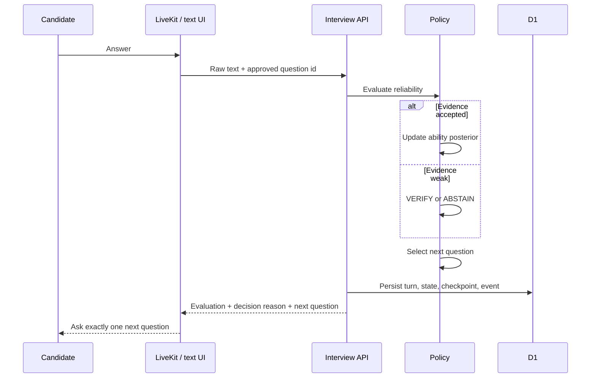

# Architecture

## System boundary

The browser and LiveKit worker are transports. They are not allowed to choose a
question, overwrite a score, or paraphrase stored evidence. All decision state
passes through the interview API.



## State machine

Happy path:

```text
CREATED -> ANCHOR_INTERVIEW -> ADAPTIVE_INTERVIEW
        -> FINALIZING -> COMPLETED
```

`VERIFYING` is a bounded branch. `PAUSED`, `RECOVERING`, `FAILED` and
`CANCELLED` are explicit states so recovery logic is testable rather than
hidden in prompts.

## Persistence

| Table | Purpose |
| --- | --- |
| `interviews` | Session configuration, current state and versioned checkpoint |
| `interview_turns` | Approved question, raw answer, evidence and evaluation |
| `skill_states` | Ability posterior, uncertainty and accepted evidence |
| `agent_events` | Transition, latency, token/cost and decision audit log |
| `user_feedback` | Human usefulness signal for offline evaluation |

JSON is validated by the API and stored as text for D1/SQLite portability.

## Dual implementation

`services/agent` contains the higher-fidelity Python policy kernel. The web API
currently uses `app/lib/agent-policy.ts`, a compact edge-compatible mirror, so
the demo runs without a separate container. Before reporting experimental
results, golden fixtures must prove equivalent state transitions, ability
updates, reliability actions and selected question ids.

## Security and privacy

- API secrets never enter client code.
- Original recordings are disabled by default.
- Stored evidence is the submitted text or LiveKit final transcript, not an
  LLM summary.
- The scoring surface excludes biometric and affective features.
- Reports are explicitly training feedback, not automated employment decisions.
