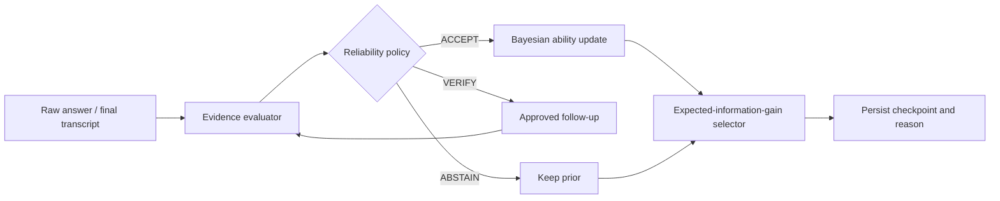

# Interview guide

This document keeps the project explainable by one student. Do not memorize
marketing language; be able to derive and modify the decisions below.

## 90-second project introduction

> I built StatInterview Coach, an adaptive interview-training Agent for Chinese
> data-analysis internships. The problem I focus on is not generating more
> questions, but deciding what to ask under a six-question budget and refusing
> to score weak evidence. Four anchors establish comparable coverage. A
> discrete Bayesian ability state stores both mean and uncertainty. The Agent
> then selects two follow-ups using expected information gain, job relevance,
> coverage and time cost. If answer evidence is unreliable, a bounded
> verification policy asks an approved follow-up or abstains instead of
> updating ability. The web flow, D1 checkpoints, evidence report and LiveKit
> browser/worker boundary are implemented. The final report deterministically
> replays every decision, decomposes the top candidate utilities and generates
> a SHA-256 policy fingerprint; a counterfactual test proves that a legal but
> non-selected question is detected. I also wrote Python and TypeScript parity
> fixtures and a reproducible 4,000-candidate simulation. Under the
> stated assumptions, adaptive selection reduced job-weighted MAE by 2.29%
> versus a fixed sequence; the effect was small for balanced roles, which is an
> important limitation rather than something I hide.

## The technical throughline

Every module exists to support one of these decisions. UI polish, camera
preview and future user history are secondary.

## Five questions you must answer from first principles

### Why is this an Agent rather than a form workflow?

It maintains an explicit belief state, observes evidence, chooses among
multiple actions, invokes tools, changes the next question based on state and
persists a recoverable decision trace. The language model controls
conversation, but it cannot bypass the deterministic policy API.

### Why four anchors before adaptation?

Without anchors, a personalized path may be efficient but incomparable. One
anchor per dimension creates minimum coverage and makes later uncertainty
meaningful. The trade-off is that only two of six questions remain adaptive.

### What does expected information gain mean?

For each candidate question, compute current posterior entropy. Simulate the
posterior after a correct and incorrect response, weight both entropies by
their predictive probability, and subtract from current entropy. Questions
near the current ability usually reduce uncertainty more.

### Why not trust the LLM's confidence?

Self-reported confidence is not calibrated. Reliability is based on observable
signals such as evidence coverage, transcript completeness, answer units,
schema validity and double-pass score disagreement. Low reliability blocks the
ability update.

### Is the 2.29% result meaningful?

It is evidence that the implementation behaves as intended under a Rasch
simulation. It is not a user-learning or hiring-validity result. The balanced
profile has almost no benefit, so job weighting—not generic adaptivity—is the
main source of gain.

## Five-minute demo

1. Open the landing page and state the narrow problem.
2. Create a text interview with a JD emphasizing SQL/data engineering.
3. Answer four anchors; show the state and decision reason.
4. Show that follow-ups concentrate on the JD-relevant dimension.
5. Submit a short, weak answer; show `VERIFY`, then `ABSTAIN` if evidence
   remains weak.
6. Open the report and trace a conclusion to the exact answer excerpt.
7. Expand the decision audit; show 6/6 replay, then explain why the final two
   questions outranked their alternatives.
8. Open `/lab`; explain the fixed/random ablation and the balanced-role
   limitation.
9. If LiveKit credentials and the worker are running, switch one turn to voice.
   Otherwise explicitly say the media code is complete but the hosted
   credential-dependent call has not been measured.

## Honest resume wording

> StatInterview Coach — uncertainty-aware adaptive interview training Agent
>
> - Built an explicit Agent state machine with four anchor questions, bounded
>   verification/abstention and D1 checkpoint recovery; reports trace conclusions
>   to verbatim answer evidence.
> - Implemented a discrete Bayesian/Rasch ability state and a constrained
>   expected-information-gain selector; added shared Python/TypeScript golden
>   fixtures to prevent edge-policy drift.
> - Built deterministic decision replay with five invariants, counterfactual
>   candidate rankings and a SHA-256 fingerprint; added a tamper test that
>   detects a bank-approved question not chosen by the policy.
> - Ran a deterministic 4,000-candidate paired simulation under a six-question
>   budget; adaptive selection reduced job-weighted MAE by 2.29% versus a fixed
>   sequence, with gains concentrated in uneven job profiles.
> - Integrated a short-lived LiveKit room-token endpoint and Python Agent worker
>   that stores final raw transcripts and delegates scoring/selection to the
>   policy API.

Do not write “production-grade voice system,” “validated hiring predictor,” or
“forked and shipped LiveKit Meet” until those statements become true.

## Before applying

- Run all tests and the benchmark from a clean checkout.
- Practice changing one selection weight and predicting the effect.
- Practice adding one question and explaining its difficulty mapping.
- Prepare one failure story: low evidence, interrupted session or policy
  parity drift.
- Recruit at least 10 users if time permits and report the raw sample size,
  disagreements and negative cases.
